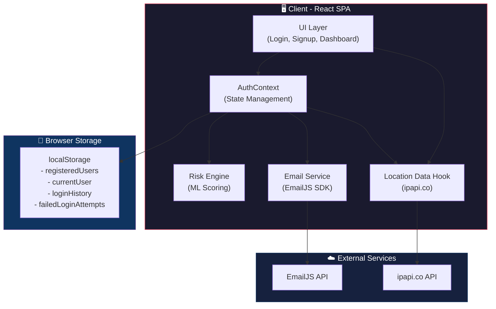
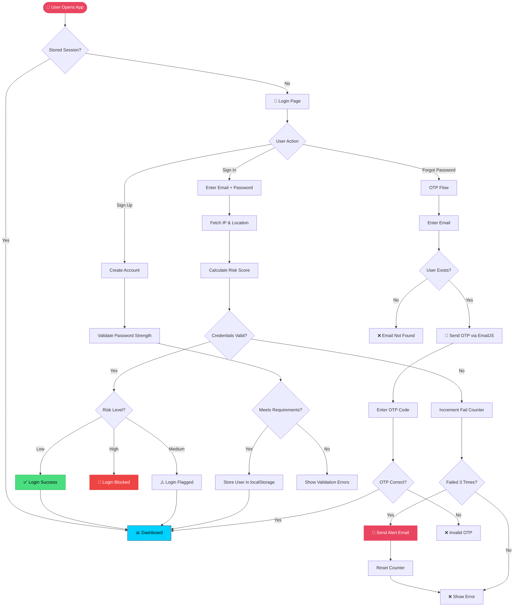
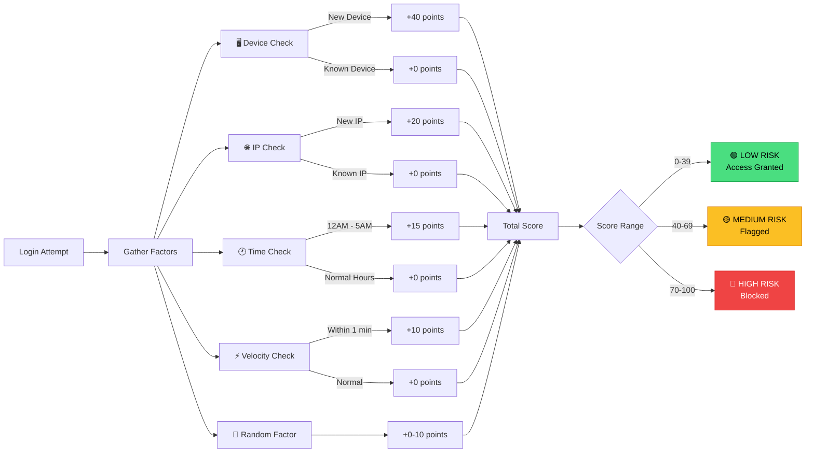
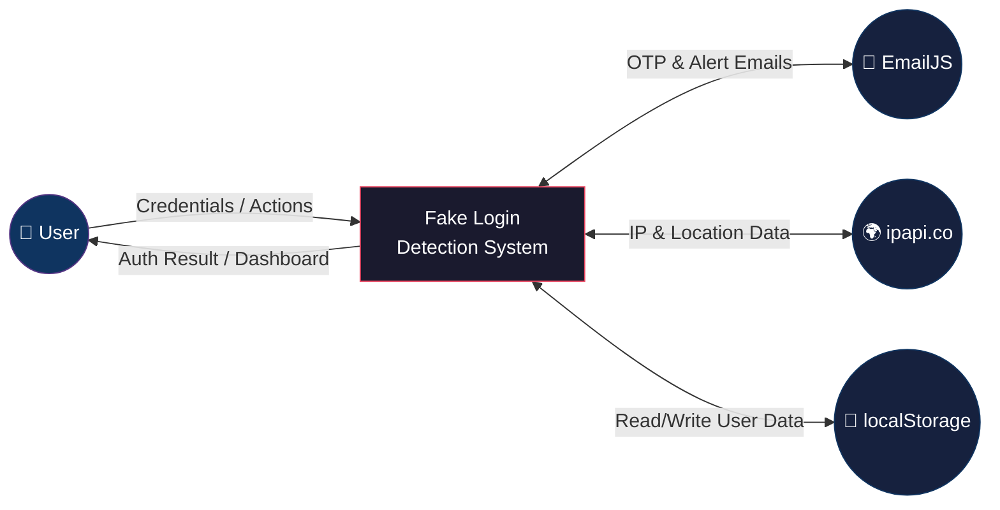
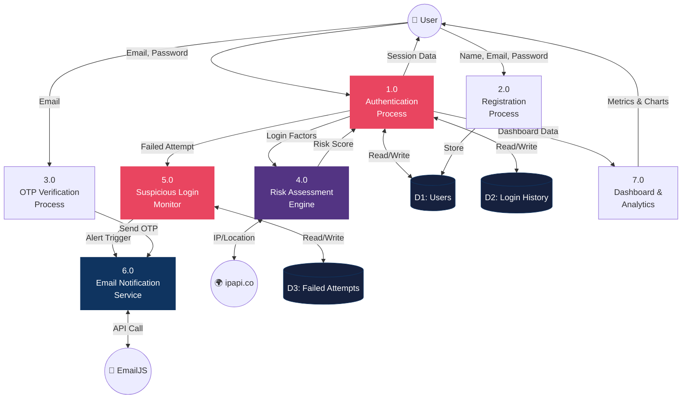
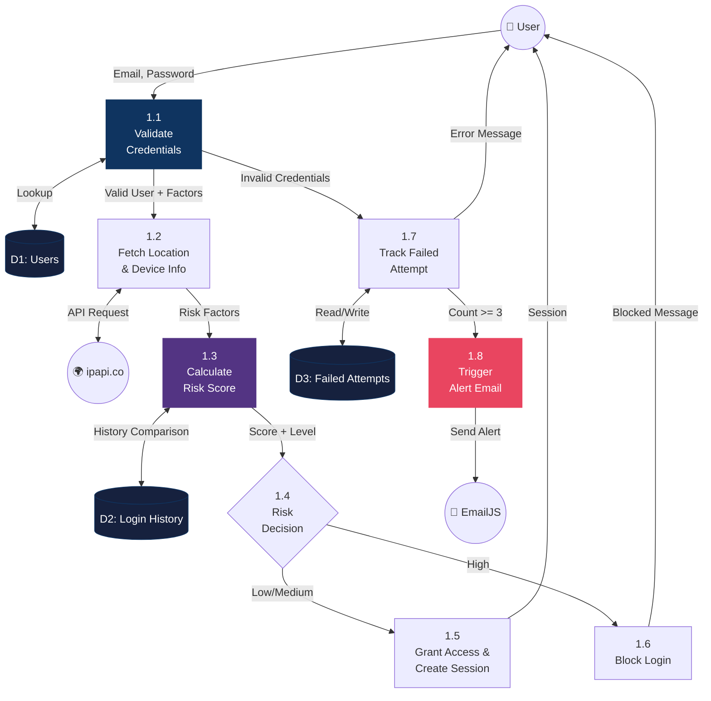

# 🛡️ Fake Login Detection System

> An ML-powered authentication security platform that detects suspicious login activity, performs real-time risk assessment, and sends email alerts — built with **React**, **TypeScript**, **Tailwind CSS v4**, and **Shadcn UI**.

---

## ✨ Features

| Feature | Description |
|---------|-------------|
| 🔐 **Secure Authentication** | Sign up, sign in, and session persistence via localStorage |
| 🤖 **ML Risk Engine** | Real-time risk scoring based on device, IP, location, and time anomalies |
| 🚨 **Suspicious Login Alerts** | Automatic email alert after 3 consecutive failed login attempts |
| 📧 **OTP Verification** | Forgot password flow with real email-based OTP via EmailJS |
| 📊 **Security Dashboard** | Live metrics, login history, trend analysis, and session details |
| 🌍 **Geo-Location Tracking** | Real-time IP, city, country, and ISP detection via ipapi.co |
| 📱 **Device Fingerprinting** | Browser, OS, device type, screen resolution, and timezone detection |

---

## 🏗️ System Architecture



---

## 🔄 Authentication Flowchart



---

## 🤖 ML Risk Assessment Flowchart



---

## 📊 Data Flow Diagrams

### DFD Level 0 — Context Diagram



### DFD Level 1 — Major Processes



### DFD Level 2 — Authentication Process (1.0)



---

## 📁 Project Structure

```
fake_login/
├── public/                     # Static assets
├── src/
│   ├── App.tsx                 # Main app - routing & login handler
│   ├── index.tsx               # React entry point
│   ├── components/
│   │   ├── login-page.tsx      # Login form + OTP forgot password
│   │   ├── signup-page.tsx     # Registration with password validation
│   │   ├── dashboard.tsx       # Security dashboard & analytics
│   │   ├── security-info.tsx   # Device & location display card
│   │   └── ui/                 # Shadcn UI primitives (30+ components)
│   ├── context/
│   │   └── AuthContext.tsx     # Auth state, login/signup logic,
│   │                           # failed attempts tracking, risk integration
│   ├── hooks/
│   │   └── useLocationData.ts  # IP & geolocation hook (ipapi.co)
│   ├── utils/
│   │   ├── email-service.ts    # EmailJS: OTP sender + suspicious alert
│   │   └── risk-engine.ts      # ML risk scoring algorithm
│   └── styles/                 # Tailwind, theme, fonts
├── .env                        # EmailJS credentials
├── package.json
├── craco.config.js             # CRA build overrides
└── tsconfig.json
```

---

## 🛠️ Tech Stack

| Layer | Technology |
|-------|-----------|
| **Framework** | React 18 + TypeScript |
| **Styling** | Tailwind CSS v4, Shadcn UI (Radix Primitives) |
| **Build Tool** | Create React App + Craco |
| **Email Service** | EmailJS (OTP template + Alert template) |
| **Geolocation** | ipapi.co REST API |
| **State** | React Context + localStorage |
| **Animations** | Motion (Framer Motion) |
| **Charts** | Recharts |

---

## 🚀 Getting Started

### Prerequisites

- **Node.js** v18+
- **npm**

### Environment Setup

Create a `.env` file in the project root:

```env
REACT_APP_EMAILJS_SERVICE_ID=your_service_id
REACT_APP_EMAILJS_TEMPLATE_ID=your_otp_template_id
REACT_APP_EMAILJS_PUBLIC_KEY=your_public_key
```

> **Note:** The suspicious login alert uses a separate template ID configured in `email-service.ts`.

### Installation & Running

```bash
# Clone the repository
git clone https://github.com/miran786/Fake-Login-Detection.git
cd fake_login

# Install dependencies
npm install

# Start development server
npm start
```

The app will open at **http://localhost:3000**.

### Production Build

```bash
npm run build
```

---

## 🔒 Security Features in Detail

### Suspicious Login Alert (3-Strike System)

```
Attempt 1: ❌ Wrong password → Counter = 1
Attempt 2: ❌ Wrong password → Counter = 2
Attempt 3: ❌ Wrong password → Counter = 3 → 🚨 EMAIL ALERT SENT → Counter reset
```

An HTML email with IP address, device, location, and timestamp is sent to the account email via EmailJS using a dedicated security alert template.

### Risk Score Calculation

| Factor | Points | Condition |
|--------|--------|-----------|
| New Device | +40 | Device not in login history |
| New IP Address | +20 | IP not seen before |
| Unusual Time | +15 | Login between 12 AM – 5 AM |
| High Velocity | +10 | Login within 1 minute of last attempt |
| Random Noise | +0-10 | Simulates unseen ML factors |

**Risk Levels:** Low (0-39) · Medium (40-69) · High (70-100)

---

## 📝 How It Works

1. **No Real Backend** — User data lives in browser `localStorage`, making it fully client-side.
2. **Real Emails** — Uses EmailJS SDK for actual email delivery (OTPs and security alerts).
3. **Live Geolocation** — Fetches real IP and location data from `ipapi.co`.
4. **Privacy First** — No data is sent to any custom server; everything stays in your browser.
5. **Demo Friendly** — Create any account you want to test the full flow.

---

## 📄 License

This project is for educational and demonstration purposes.

---

<p align="center">
  <b>Built with 🛡️ by the Fake Login Detection Team</b>
</p>
