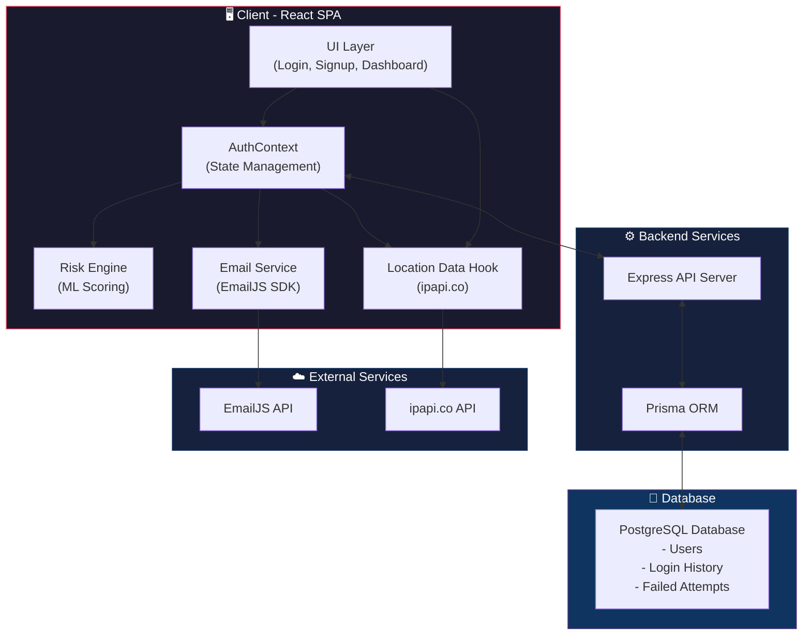
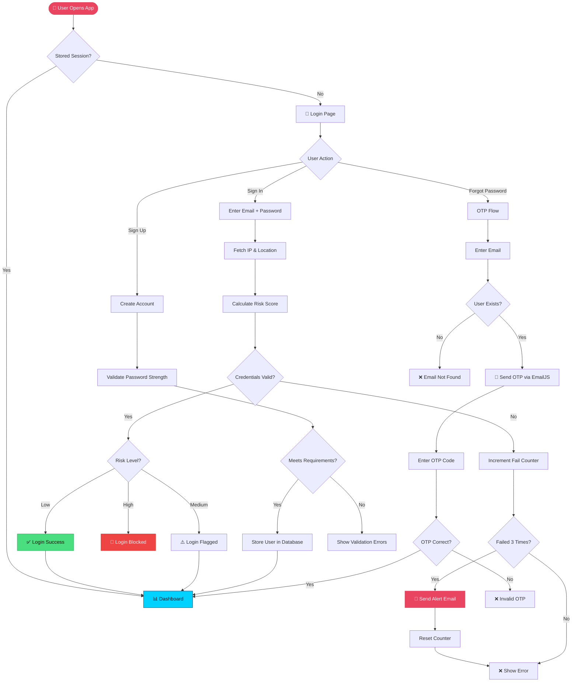
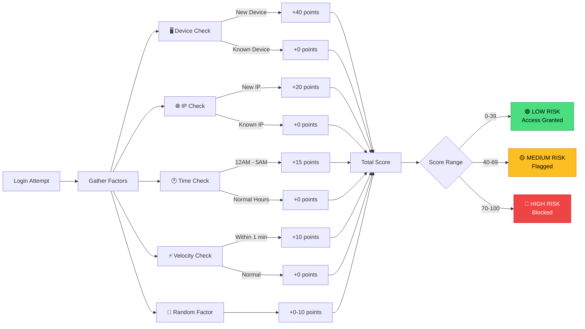
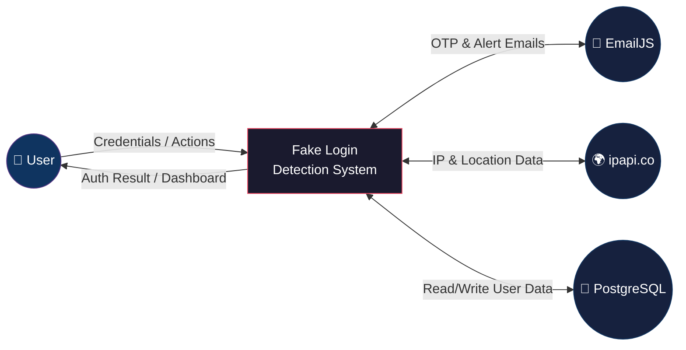
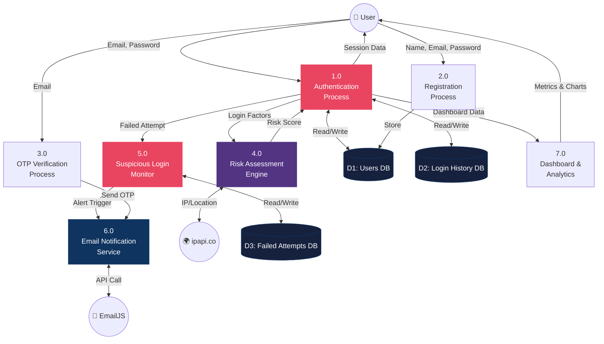
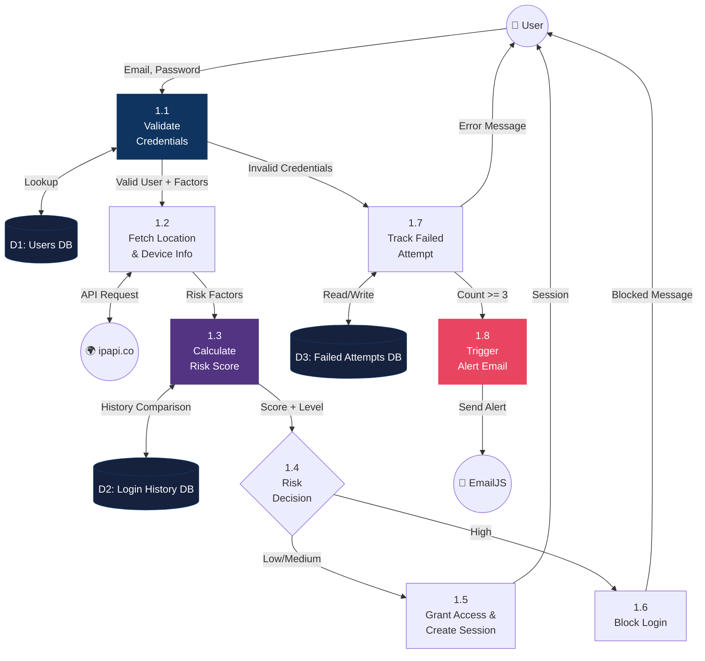

# 🛡️ Fake Login Detection System

> An ML-powered authentication security platform that detects suspicious login activity, performs real-time risk assessment, and sends email alerts — built with **React**, **TypeScript**, **Express**, **Prisma**, **PostgreSQL**, and **Docker**.

---

## ✨ Features

| Feature | Description |
|---------|-------------|
| 🔐 **Secure Authentication** | Sign up, sign in, and secure session management via backend API |
| 🗄️ **Robust Backend** | Node.js / Express backend with a PostgreSQL database managed via Prisma ORM |
| 🤖 **ML Risk Engine** | Real-time risk scoring based on device, IP, location, and time anomalies |
| 🚨 **Suspicious Login Alerts** | Automatic email alert after 3 consecutive failed login attempts |
| 📧 **OTP Verification** | Forgot password flow with real email-based OTP via EmailJS |
| 📊 **Security Dashboard** | Live metrics, login history, trend analysis, and session details |
| 🌍 **Geo-Location Tracking** | Real-time IP, city, country, and ISP detection via ipapi.co |
| 📱 **Device Fingerprinting** | Browser, OS, device type, screen resolution, and timezone detection |
| 🐳 **Dockerized Deployment** | Easy one-command setup using Docker and Docker Compose |

---

## 🏗️ System Architecture


```mermaid
graph TB
    subgraph Client["🖥️ Client - React SPA"]
        UI["UI Layer<br/>(Login, Signup, Dashboard)"]
        AC["AuthContext<br/>(State Management)"]
        RE["Risk Engine<br/>(ML Scoring)"]
        ES["Email Service<br/>(EmailJS SDK)"]
        LD["Location Data Hook<br/>(ipapi.co)"]
    end

    subgraph Backend["⚙️ Backend Services"]
        API["Express API Server"]
        ORM["Prisma ORM"]
    end

    subgraph External["☁️ External Services"]
        EJS["EmailJS API"]
        IPAPI["ipapi.co API"]
    end

    subgraph Storage["🐘 Database"]
        DB["PostgreSQL Database<br/>- Users<br/>- Login History<br/>- Failed Attempts"]
    end

    UI --> AC
    AC --> RE
    AC --> ES
    AC --> LD
    UI --> LD
    ES --> EJS
    LD --> IPAPI
    AC <--> API
    API <--> ORM
    ORM <--> DB

    style Client fill:#1a1a2e,stroke:#e94560,color:#fff
    style Backend fill:#16213e,stroke:#0f3460,color:#fff
    style External fill:#16213e,stroke:#0f3460,color:#fff
    style Storage fill:#0f3460,stroke:#533483,color:#fff
```

---

## 🔄 Authentication Flowchart


```mermaid
flowchart TD
    A([🚀 User Opens App]) --> B{Stored Session?}
    B -->|Yes| C[📊 Dashboard]
    B -->|No| D[🔐 Login Page]
    
    D --> E{User Action}
    E -->|Sign In| F[Enter Email + Password]
    E -->|Sign Up| G[Create Account]
    E -->|Forgot Password| H[OTP Flow]
    
    F --> I[Fetch IP & Location]
    I --> J[Calculate Risk Score]
    J --> K{Credentials Valid?}
    
    K -->|Yes| L{Risk Level?}
    L -->|Low| M[✅ Login Success]
    L -->|Medium| N[⚠️ Login Flagged]
    L -->|High| O[🚫 Login Blocked]
    
    K -->|No| P[Increment Fail Counter]
    P --> Q{Failed 3 Times?}
    Q -->|Yes| R[🚨 Send Alert Email]
    R --> S[Reset Counter]
    S --> T[❌ Show Error]
    Q -->|No| T
    
    M --> C
    N --> C
    
    G --> U[Validate Password Strength]
    U --> V{Meets Requirements?}
    V -->|Yes| W[Store User in Database]
    W --> C
    V -->|No| X[Show Validation Errors]
    
    H --> Y[Enter Email]
    Y --> Z{User Exists?}
    Z -->|Yes| AA[📧 Send OTP via EmailJS]
    AA --> BB[Enter OTP Code]
    BB --> CC{OTP Correct?}
    CC -->|Yes| C
    CC -->|No| DD[❌ Invalid OTP]
    Z -->|No| EE[❌ Email Not Found]

    style A fill:#e94560,stroke:#e94560,color:#fff
    style C fill:#00d2ff,stroke:#0f3460,color:#000
    style R fill:#e94560,stroke:#e94560,color:#fff
    style M fill:#4ade80,stroke:#16a34a,color:#000
    style O fill:#ef4444,stroke:#dc2626,color:#fff
```

---

## 🤖 ML Risk Assessment Flowchart


```mermaid
flowchart LR
    A[Login Attempt] --> B[Gather Factors]
    
    B --> C1[🖥️ Device Check]
    B --> C2[🌐 IP Check]
    B --> C3[🕐 Time Check]
    B --> C4[⚡ Velocity Check]
    B --> C5[🎲 Random Factor]
    
    C1 -->|New Device| D1["+40 points"]
    C1 -->|Known Device| D1b["+0 points"]
    
    C2 -->|New IP| D2["+20 points"]
    C2 -->|Known IP| D2b["+0 points"]
    
    C3 -->|12AM - 5AM| D3["+15 points"]
    C3 -->|Normal Hours| D3b["+0 points"]
    
    C4 -->|Within 1 min| D4["+10 points"]
    C4 -->|Normal| D4b["+0 points"]
    
    C5 --> D5["+0-10 points"]
    
    D1 & D2 & D3 & D4 & D5 --> E[Total Score]
    D1b & D2b & D3b & D4b --> E
    
    E --> F{Score Range}
    F -->|0-39| G["🟢 LOW RISK<br/>Access Granted"]
    F -->|40-69| H["🟡 MEDIUM RISK<br/>Flagged"]
    F -->|70-100| I["🔴 HIGH RISK<br/>Blocked"]

    style G fill:#4ade80,stroke:#16a34a,color:#000
    style H fill:#fbbf24,stroke:#d97706,color:#000
    style I fill:#ef4444,stroke:#dc2626,color:#fff
```

---

## 📊 Data Flow Diagrams

### DFD Level 0 — Context Diagram


```mermaid
graph LR
    U(("👤 User")) -->|Credentials / Actions| S["Fake Login<br/>Detection System"]
    S -->|Auth Result / Dashboard| U
    S <-->|OTP & Alert Emails| EJS(("📧 EmailJS"))
    S <-->|IP & Location Data| API(("🌍 ipapi.co"))
    S <-->|Read/Write User Data| DB(("🐘 PostgreSQL"))

    style S fill:#1a1a2e,stroke:#e94560,color:#fff
    style U fill:#0f3460,stroke:#533483,color:#fff
    style EJS fill:#16213e,stroke:#0f3460,color:#fff
    style API fill:#16213e,stroke:#0f3460,color:#fff
    style DB fill:#16213e,stroke:#0f3460,color:#fff
```

### DFD Level 1 — Major Processes


```mermaid
graph TB
    U(("👤 User"))

    U -->|Email, Password| P1["1.0<br/>Authentication<br/>Process"]
    U -->|Name, Email, Password| P2["2.0<br/>Registration<br/>Process"]
    U -->|Email| P3["3.0<br/>OTP Verification<br/>Process"]

    P1 -->|Login Factors| P4["4.0<br/>Risk Assessment<br/>Engine"]
    P1 -->|Failed Attempt| P5["5.0<br/>Suspicious Login<br/>Monitor"]

    P4 -->|Risk Score| P1
    P5 -->|Alert Trigger| P6["6.0<br/>Email Notification<br/>Service"]

    P3 -->|Send OTP| P6

    P6 <-->|API Call| EJS(("📧 EmailJS"))
    P4 <-->|IP/Location| API(("🌍 ipapi.co"))

    P1 <-->|Read/Write| DS1[("D1: Users DB")]
    P2 -->|Store| DS1
    P1 <-->|Read/Write| DS2[("D2: Login History DB")]
    P5 <-->|Read/Write| DS3[("D3: Failed Attempts DB")]

    P1 -->|Session Data| U
    P1 -->|Dashboard Data| P7["7.0<br/>Dashboard &<br/>Analytics"]
    P7 -->|Metrics & Charts| U

    style P1 fill:#e94560,stroke:#e94560,color:#fff
    style P4 fill:#533483,stroke:#533483,color:#fff
    style P5 fill:#e94560,stroke:#e94560,color:#fff
    style P6 fill:#0f3460,stroke:#0f3460,color:#fff
    style DS1 fill:#16213e,stroke:#0f3460,color:#fff
    style DS2 fill:#16213e,stroke:#0f3460,color:#fff
    style DS3 fill:#16213e,stroke:#0f3460,color:#fff
```

### DFD Level 2 — Authentication Process (1.0)


```mermaid
graph TB
    U(("👤 User")) -->|Email, Password| P1_1["1.1<br/>Validate<br/>Credentials"]

    P1_1 <-->|Lookup| DS1[("D1: Users DB")]
    P1_1 -->|Valid User + Factors| P1_2["1.2<br/>Fetch Location<br/>& Device Info"]

    P1_2 <-->|API Request| API(("🌍 ipapi.co"))
    P1_2 -->|Risk Factors| P1_3["1.3<br/>Calculate<br/>Risk Score"]

    P1_3 <-->|History Comparison| DS2[("D2: Login History DB")]
    P1_3 -->|Score + Level| P1_4{"1.4<br/>Risk<br/>Decision"}

    P1_4 -->|Low/Medium| P1_5["1.5<br/>Grant Access &<br/>Create Session"]
    P1_4 -->|High| P1_6["1.6<br/>Block Login"]

    P1_1 -->|Invalid Credentials| P1_7["1.7<br/>Track Failed<br/>Attempt"]
    P1_7 <-->|Read/Write| DS3[("D3: Failed Attempts DB")]
    P1_7 -->|Count >= 3| P1_8["1.8<br/>Trigger<br/>Alert Email"]
    P1_8 -->|Send Alert| EJS(("📧 EmailJS"))

    P1_5 -->|Session| U
    P1_6 -->|Blocked Message| U
    P1_7 -->|Error Message| U

    style P1_1 fill:#0f3460,stroke:#0f3460,color:#fff
    style P1_3 fill:#533483,stroke:#533483,color:#fff
    style P1_8 fill:#e94560,stroke:#e94560,color:#fff
    style DS1 fill:#16213e,stroke:#0f3460,color:#fff
    style DS2 fill:#16213e,stroke:#0f3460,color:#fff
    style DS3 fill:#16213e,stroke:#0f3460,color:#fff
```

---

## 📁 Project Structure

```
fake_login/
├── backend/                    # Node.js + Express Backend
│   ├── prisma/                 # Database Schema
│   ├── src/                    # API Routes and Controllers
│   ├── package.json
│   └── Dockerfile              # Backend Container definition
├── public/                     # Static assets
├── src/                        # React Frontend App
│   ├── App.tsx                 # Main app - routing & login handler
│   ├── index.tsx               # React entry point
│   ├── components/             # React components
│   ├── context/
│   │   └── AuthContext.tsx     # Auth state, login/signup API hooks
│   ├── hooks/
│   │   └── useLocationData.ts  # IP & geolocation hook (ipapi.co)
│   ├── utils/
│   │   ├── email-service.ts    # EmailJS: OTP sender + suspicious alert
│   │   └── risk-engine.ts      # ML risk scoring algorithm
│   └── styles/                 # Tailwind, theme, fonts
├── docker-compose.yml          # Docker composition config
├── Dockerfile                  # Frontend Container (Nginx)
├── .env                        # Environment variables
└── package.json
```

---

## 🛠️ Tech Stack

| Layer | Technology |
|-------|-----------|
| **Frontend** | React 18, TypeScript, Tailwind CSS v4, Shadcn UI |
| **Backend** | Node.js, Express, TypeScript |
| **Database** | PostgreSQL, Prisma ORM |
| **Infrastructure** | Docker, Docker Compose, Nginx |
| **Email Service** | EmailJS (OTP template + Alert template) |
| **Geolocation** | ipapi.co REST API |
| **State** | React Context |
| **Animations** | Motion (Framer Motion) |
| **Charts** | Recharts |

---

## 🚀 Getting Started

### Prerequisites

- **Docker** and **Docker Compose** installed on your system.

### Environment Setup

Create a `.env` file in the project root:

```env
REACT_APP_EMAILJS_SERVICE_ID=your_service_id
REACT_APP_EMAILJS_TEMPLATE_ID=your_otp_template_id
REACT_APP_EMAILJS_PUBLIC_KEY=your_public_key
```

### Running the Application

This project is fully dockerized. To start the application (Frontend + Backend + PostgreSQL), simply run:

```bash
# Clone the repository
git clone https://github.com/miran786/Fake-Login-Detection.git
cd fake_login

# Build and start the containers in detached mode
docker-compose up --build -d
```

- **Frontend** will be available at **http://localhost**
- **Backend API** will be available at **http://localhost:5000**
- **Database** will be exposed on **localhost:5432**

### Stopping the Application

```bash
docker-compose down
```

### Manual Development Setup (Without Docker)

If you prefer to run the services manually:

**1. Database**
Ensure you have PostgreSQL running and update `DATABASE_URL` in `backend/.env`.

**2. Backend**
```bash
cd backend
npm install
npx prisma db push
npm run build
npm run start:prod
```

**3. Frontend**
```bash
# From the root directory
npm install
npm start
```

---

## 🔒 Security Features in Detail

### Suspicious Login Alert (3-Strike System)

```
Attempt 1: ❌ Wrong password → Counter = 1
Attempt 2: ❌ Wrong password → Counter = 2
Attempt 3: ❌ Wrong password → Counter = 3 → 🚨 EMAIL ALERT SENT → Counter reset
```

An HTML email with IP address, device, location, and timestamp is sent to the account email via EmailJS using a dedicated security alert template.

### Risk Score Calculation

| Factor | Points | Condition |
|--------|--------|-----------|
| New Device | +40 | Device not in login history |
| New IP Address | +20 | IP not seen before |
| Unusual Time | +15 | Login between 12 AM – 5 AM |
| High Velocity | +10 | Login within 1 minute of last attempt |
| Random Noise | +0-10 | Simulates unseen ML factors |

**Risk Levels:** Low (0-39) · Medium (40-69) · High (70-100)

---

## 📝 How It Works

1. **Full-Stack Architecture** — The application now uses an Express + Prisma backend with a PostgreSQL database, providing a robust scalable foundation architecture replacing the earlier client-only local storage system.
2. **Real Emails** — Uses EmailJS SDK for actual email delivery (OTPs and security alerts).
3. **Live Geolocation** — Fetches real IP and location data from `ipapi.co`.
4. **Automated Deployment** — Docker Compose seamlessly links the Postgres DB, the Node backend, and the React frontend.
5. **Demo Friendly** — Create any account you want to test the full flow.

---

## 📄 License

This project is for educational and demonstration purposes.

---

<p align="center">
  <b>Built with 🛡️ by the Fake Login Detection Team</b>
</p>
